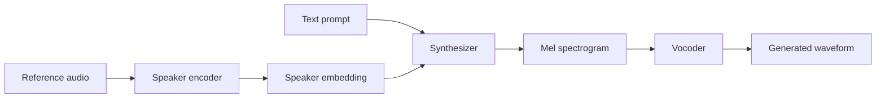
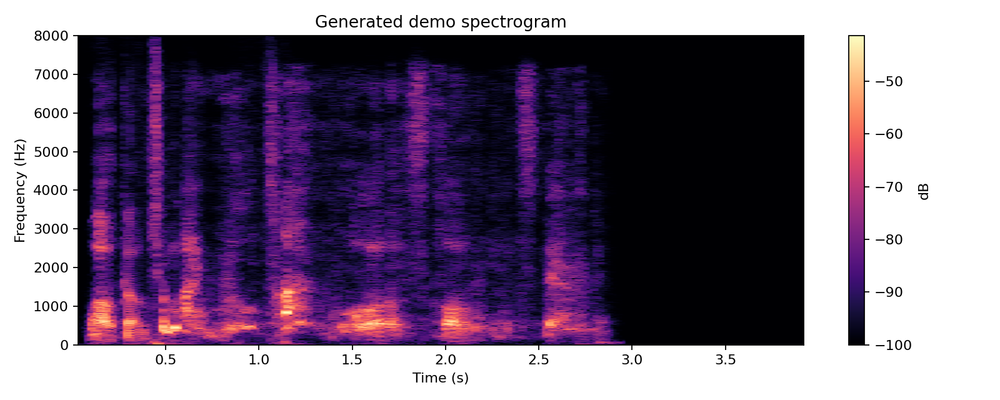

# Real-Time Voice Cloning - Modernized Fork

This repository is a modernized fork of [CorentinJ/Real-Time-Voice-Cloning](https://github.com/CorentinJ/Real-Time-Voice-Cloning), a classic SV2TTS voice cloning implementation based on [Transfer Learning from Speaker Verification to Multispeaker Text-To-Speech Synthesis](https://arxiv.org/pdf/1806.04558.pdf).

My goal with this fork is to reproduce, maintain, and improve the development workflow around a proven speaker encoder -> synthesizer -> vocoder pipeline.

## Modernization Work

- Reproducible Python environment with `uv`
- CPU and CUDA install profiles through `pyproject.toml`
- GitHub Actions CI for dependency and import smoke tests
- Lightweight functional test coverage for encoder preprocessing
- Automatic pretrained model download from Hugging Face
- Non-interactive one-command cloning CLI
- Setup diagnostics with `voice-clone-doctor`
- Windows/Linux setup and troubleshooting notes
- Clear responsible-use guidance for voice cloning experiments

## Pipeline



The original project implements three SV2TTS stages:

- `encoder/`: extracts a speaker embedding from a short voice reference
- `synthesizer/`: turns text and speaker embedding into a mel spectrogram
- `vocoder/`: converts the spectrogram into waveform audio

See [docs/ARCHITECTURE.md](docs/ARCHITECTURE.md) for a more detailed walkthrough.

## Quick Start

Install [ffmpeg](https://ffmpeg.org/download.html#get-packages), then install [uv](https://docs.astral.sh/uv/):

```powershell
powershell -ExecutionPolicy ByPass -c "irm https://astral.sh/uv/install.ps1 | iex"
```

On Linux:

```bash
curl -LsSf https://astral.sh/uv/install.sh | sh
```

Run the GUI toolbox:

```bash
uv run --extra cpu demo_toolbox.py
uv run --extra cuda demo_toolbox.py
```

Run the original interactive CLI:

```bash
uv run --extra cpu demo_cli.py
uv run --extra cuda demo_cli.py
```

Check your setup before running model inference:

```bash
uv run --extra cpu voice-clone-doctor
```

## One-Command Voice Cloning

Generate audio from a reference sample and text prompt:

```bash
uv run --extra cpu clone-voice \
  --reference samples/p240_00000.mp3 \
  --text "Welcome to my real-time voice cloning experiment." \
  --output outputs/demo_output.wav
```

Use CUDA on an NVIDIA GPU:

```bash
uv run --extra cuda clone-voice \
  --reference samples/p240_00000.mp3 \
  --text "Welcome to my real-time voice cloning experiment." \
  --output outputs/demo_output.wav
```

The first run downloads pretrained SV2TTS models from [Hugging Face](https://huggingface.co/CorentinJ/SV2TTS/tree/main) into `saved_models/default/`. The generated WAV is written to the path passed with `--output`, and the CLI prints stage timings for local benchmarking.

## Toolbox Preview


## Demo

Reference voice for normal runs:

```text
samples/p240_00000.mp3
```

Text prompt:

```text
Welcome to my real-time voice cloning experiment.
```

Generated output:

```text
outputs/demo_output.wav
```

Generated demo spectrogram:



Run the command in the previous section to create audio locally. Generated WAV files are ignored by git so demo artifacts do not accidentally bloat the repository.

## Local Benchmark

Measured locally on Windows with Python 3.9.25 and PyTorch 1.10.2+cu113. The benchmark used a generated 5-second WAV reference at `assets/benchmark_reference.wav` because FFmpeg was not available on `PATH` for MP3 decoding during the run.

| Mode | Reference Audio | Text Length | Load Models | Encode | Synthesize | Vocode | Notes |
|---|---:|---:|---:|---:|---:|---:|---|
| CPU | 5s | 7 words | 0.13s | 0.13s | 1.43s | 18.86s | Forced CPU with `--cpu` |
| CUDA | 5s | 7 words | 4.60s | 2.25s | 4.39s | 17.19s | RTX 3050 Ti 4GB |

This is intentionally a local benchmark table, not a claimed public benchmark. Hardware, CUDA version, and audio device setup can change results substantially.

## Testing

```bash
uv sync --extra cpu --dev
uv run pytest -q
```

CI runs the same smoke and lightweight functional tests on Ubuntu with Python 3.9.

## Setup Notes

- [Windows setup](docs/SETUP_WINDOWS.md)
- [Troubleshooting](docs/TROUBLESHOOTING.md)
- [Architecture](docs/ARCHITECTURE.md)
- [Benchmarking](docs/BENCHMARK.md)
- [Comparison with upstream](docs/COMPARISON.md)
- [CV wording](docs/CV.md)

## Responsible Use

This project is intended for research, learning, and reproducibility work.

Do not clone or synthesize a person's voice without explicit consent. Generated audio should be clearly disclosed as synthetic. Do not use this project for impersonation, fraud, harassment, or bypassing voice authentication systems.

## Papers Implemented

| URL | Designation | Title | Implementation source |
| --- | --- | --- | --- |
| [1806.04558](https://arxiv.org/pdf/1806.04558.pdf) | SV2TTS | Transfer Learning from Speaker Verification to Multispeaker Text-To-Speech Synthesis | Original project |
| [1802.08435](https://arxiv.org/pdf/1802.08435.pdf) | WaveRNN | Efficient Neural Audio Synthesis | [fatchord/WaveRNN](https://github.com/fatchord/WaveRNN) |
| [1703.10135](https://arxiv.org/pdf/1703.10135.pdf) | Tacotron | Tacotron: Towards End-to-End Speech Synthesis | [fatchord/WaveRNN](https://github.com/fatchord/WaveRNN) |
| [1710.10467](https://arxiv.org/pdf/1710.10467.pdf) | GE2E | Generalized End-To-End Loss for Speaker Verification | Original project |

## Credits

The SV2TTS implementation and pretrained models come from [CorentinJ/Real-Time-Voice-Cloning](https://github.com/CorentinJ/Real-Time-Voice-Cloning). This fork focuses on modernization, reproducible setup, CI, documentation, and portfolio-ready usage.
