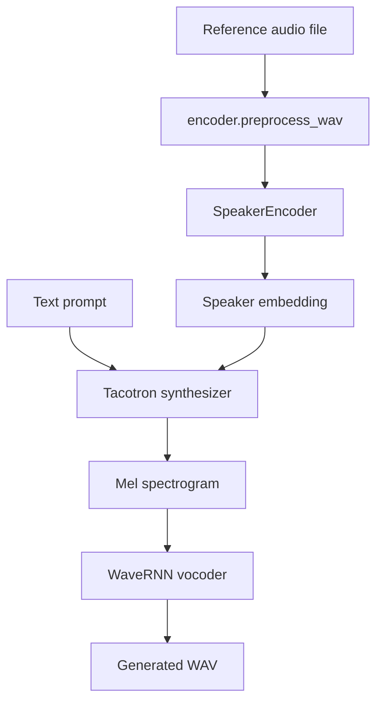

# Architecture

This project follows the SV2TTS pipeline: speaker encoder -> synthesizer -> vocoder.



## 1. Speaker Encoder

The encoder receives a short reference voice sample, normalizes and resamples it, trims long silence when voice activity detection is available, and converts the audio into a speaker embedding.

Important files:

- `encoder/audio.py`: waveform loading, normalization, resampling, silence trimming
- `encoder/inference.py`: model loading and embedding inference
- `encoder/model.py`: speaker encoder network

## 2. Synthesizer

The synthesizer receives a text prompt plus the speaker embedding, then predicts a mel spectrogram conditioned on that speaker identity.

Important files:

- `synthesizer/inference.py`: public inference wrapper
- `synthesizer/models/tacotron.py`: Tacotron model implementation
- `synthesizer/utils/text.py`: text normalization and tokenization

## 3. Vocoder

The vocoder receives the mel spectrogram and generates waveform audio.

Important files:

- `vocoder/inference.py`: public WaveRNN inference wrapper
- `vocoder/models/fatchord_version.py`: WaveRNN implementation
- `vocoder/audio.py`: audio helper functions

## Runtime Entry Points

- `demo_toolbox.py`: GUI exploration and dataset browsing
- `demo_cli.py`: original interactive CLI
- `clone_voice.py`: non-interactive CLI designed for reproducible demos and benchmarks

## Model Storage

By default, pretrained models are downloaded from Hugging Face into:

```text
saved_models/default/
  encoder.pt
  synthesizer.pt
  vocoder.pt
```

The expected model file sizes are checked in `utils/default_models.py` so corrupted or partial downloads can be replaced automatically.
